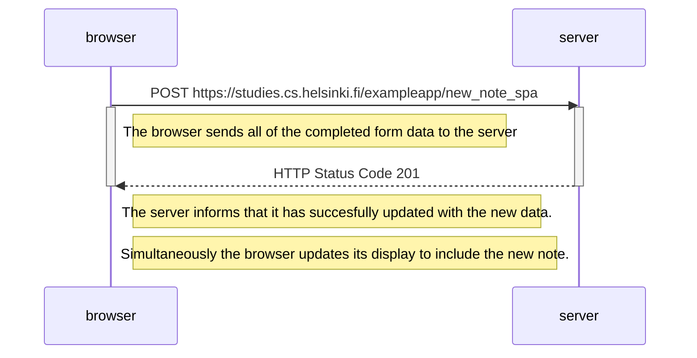

```mermaid
sequenceDiagram
    participant browser
    participant server

    browser->>server: POST https://studies.cs.helsinki.fi/exampleapp/new_note_spa
    activate server
    activate browser
    Note right of browser: The browser sends all of the completed form data to the server
    server-->>browser: HTTP Status Code 201
    deactivate browser
    deactivate server
    Note right of browser: The server informs that it has succesfully updated with the new data.
    Note right of browser: Simultaneously the browser updates its display to include the new note.
```